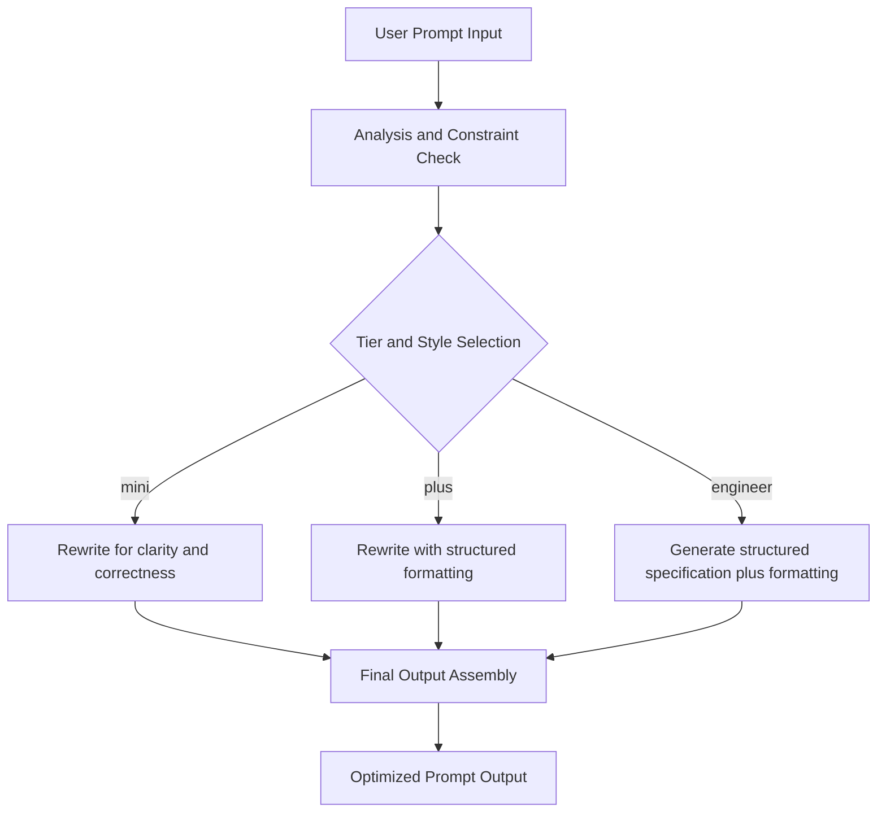
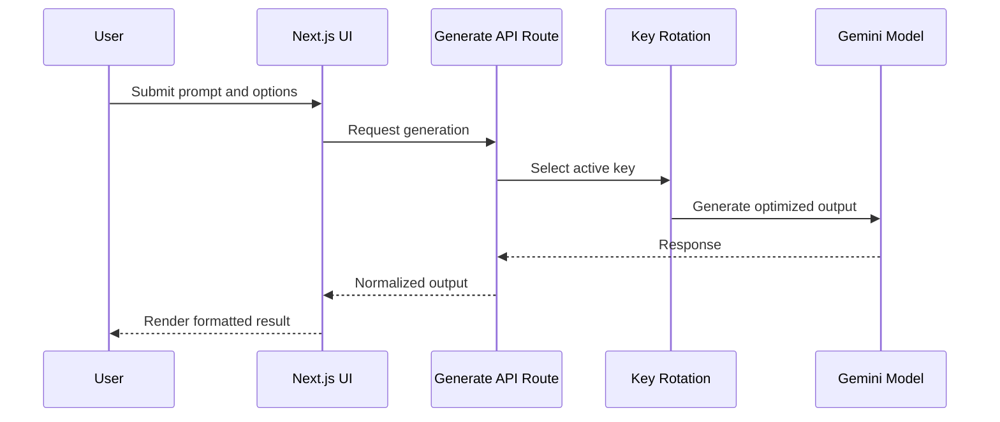

# Preceto Website

Preceto (preceto.im), intelligence massive, is an advanced prompt engineering system for optimizing, refining, and generating high-performance prompts for Large Language Models (LLMs). Built on the **HIM™ (Hybrid Entity Intelligence Model)** framework created by **David C Cavalcante**, Preceto integrates cutting-edge techniques such as Chain of Thought (CoT), Tree of Thoughts (ToT), and Self-Consistency to reduce hallucinations and enhance reasoning capabilities in complex tasks. This repository contains the Preceto web application: a production-grade Next.js interface for prompt optimization with tiered output formats and technique-aware prompting.

The project references HIM Model 1.0.4 as a structured approach for hybrid, agentic systems that combine reasoning, tool use, and retrieval. HIM™ (Hybrid Entity Intelligence Model) appears in a research abstract hosted by PhilArchive: https://philarchive.org/rec/CRTTSO.

## Product Contract

| Contract | Value |
| :--- | :--- |
| Input limit | 3000 characters |
| Output limit | 8000 characters |
| Model tiers | mini, plus, engineer |
| Styles | simple, concise, technical |
| Core techniques | CoT, ReAct, ToT, Self-Consistency, RAG |
| Primary integration | Gemini via Google GenAI SDK |

## Capabilities

| Capability | Description |
| :--- | :--- |
| Prompt optimization | Rewrites inputs into clearer, safer, and more effective prompts. |
| Technique-aware prompting | Applies reasoning and exploration strategies to improve reliability and reduce hallucinations. |
| Tiered output formats | Produces outputs suited for quick edits, structured documentation, or engineering workflows. |
| Tool integration | Enables retrieval and orchestration for RAG and multi-step prompt pipelines. |
| Resilient inference | Supports key rotation to improve availability under rate limits and transient failures. |

## HIM Model Flow (1.0.4)

## Technology Stack

| Layer | Choices |
| :--- | :--- |
| Application | Next.js (App Router), React |
| UI system | Shadcn/ui, Radix UI, Phosphor Icons |
| Styling | Tailwind CSS |
| Motion | Framer Motion |
| AI | Google GenAI SDK (Gemini) |
| Testing | Vitest, Playwright |
| Observability | Sentry (optional) |
| Analytics | Vercel Analytics, GA4 (optional) |
| Ads | Prebid and header bidding integrations (optional) |

## Repository Layout

| Path | Purpose |
| :--- | :--- |
| app | Pages, layouts, global styles, and API routes |
| app/api/generate | Prompt generation endpoint |
| components | Application components and UI primitives |
| components/ui | Shadcn/ui component library |
| lib | Prompt templates, types, utilities, and key rotation |
| docs | Product specs and prompt examples |
| __tests__ | Tests for prompt formatting and key rotation |
| public | Favicons and static assets |

## Configuration

This project requires environment variables. Do not commit secrets. Use platform-managed secrets for production, and rotate any compromised keys.

| Variable | Meaning |
| :--- | :--- |
| GEMINI_API_KEY | Comma-separated Gemini API keys used for rotation |
| GEMINI_MODEL | Gemini model identifier |
| SITE_URL | Public site URL |
| PORT | Local port |
| NODE_ENV | Runtime environment |
| GA_MEASUREMENT_ID | Analytics (optional) |
| GTM_ID | Tag Manager (optional) |
| SENTRY_DSN | Error monitoring (optional) |

## Operations

Available tasks are defined in package.json scripts.

| Task | Script |
| :--- | :--- |
| Development server | dev |
| Production build | build |
| Production start | start |
| Linting | lint |
| Type checking | type-check |
| Unit tests | test |
| E2E tests | test:e2e |

# Sponsors

Join us on our journey as we continue to innovate and create groundbreaking solutions. Your support is the cornerstone of our success!

Support us with USDT (TRC-20): `TS1vuhMAhFpbd7y68cu5ZtP9PsXVmZWmeh`

Sponsor Preceto on GitHub: [Sponsor](https://github.com/sponsors/davccavalcante)

## License

See LICENSE.txt for the binding terms governing use, copying, and distribution.

# Privacy safeguards

We protect your data with short retention windows for sensitive inputs, role-based access to session logs, and an explicit no-training policy—your prompts and feedback are never used to refine our models.
