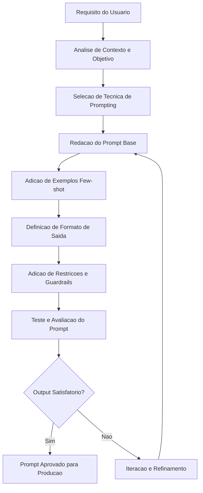

Esta skill orienta a criacao de prompts de producao para LLMs, evitando outputs genericos, ambiguos ou frageis. Implemente prompts reais e funcionais com atencao precisa a estrutura, intencao, restricoes e formato de saida esperado.

O usuario fornece os requisitos do prompt: um objetivo, contexto de uso, modelo-alvo, restricoes tecnicas ou exemplos de saida desejada. Pode incluir informacoes sobre o publico, pipeline de integracao ou comportamentos indesejaveis a evitar.

## Pensamento Estrutural Antes de Projetar

Antes de escrever qualquer prompt, compreenda o contexto completo e defina uma direcao tecnica clara:

- **Objetivo**: O que o modelo deve realizar? Qual e a tarefa nuclear?
- **Modelo-alvo**: GPT-4, Claude, Gemini, LLaMA, Mistral? Cada modelo tem sensibilidades diferentes.
- **Formato de saida**: JSON, Markdown, texto livre, lista, codigo, tabela?
- **Tom e persona**: O modelo deve agir como especialista, assistente neutro, revisor critico?
- **Restricoes**: O que o modelo NAO deve fazer? Quais topicos, formatos ou comportamentos devem ser evitados?
- **Diferencial**: O que torna este prompt robusto e nao apenas funcional?

## Tecnicas de Engenharia de Prompts

| Tecnica | Quando Usar | Beneficio Principal |
|---|---|---|
| Zero-shot | Tarefa simples e bem definida | Rapidez, sem exemplos necessarios |
| Few-shot | Tarefa com padrao de saida especifico | Calibra formato e tom via exemplos |
| Chain-of-Thought (CoT) | Raciocinio complexo, matematica, logica | Melhora acuracia em passos intermediarios |
| ReAct | Agentes com ferramentas externas | Combina raciocinio e acao iterativa |
| Role Prompting | Quando persona afeta qualidade da saida | Ancora o modelo em conhecimento especializado |
| Structured Output | Integracao com sistemas, APIs, bancos | Garante parseabilidade e consistencia |
| Self-Consistency | Decisoes criticas, respostas de alta stakes | Reduz variancia via multiplas amostras |

## Estrutura de um Prompt de Producao

Todo prompt de qualidade deve conter os seguintes blocos, adaptados ao caso de uso:

### Bloco 1 — Contexto e Persona

```
Voce e um engenheiro senior de dados especializado em pipelines de MLOps.
Seu objetivo e revisar configuracoes de infraestrutura e identificar riscos operacionais.
Responda sempre em portugues brasileiro, de forma tecnica e direta.
```

### Bloco 2 — Instrucao Principal

```
Dado o arquivo de configuracao abaixo, identifique:
1. Possiveis falhas de seguranca
2. Dependencias desatualizadas
3. Configuracoes de performance subotimas

Organize sua resposta em secoes claras com titulos Markdown.
```

### Bloco 3 — Exemplos (Few-shot)

```markdown
Entrada de exemplo:
"""
model: gpt-3.5-turbo
temperature: 1.9
max_tokens: 50
"""

Saida esperada:
### Riscos Identificados
- `temperature: 1.9` esta acima do limite recomendado (1.0), podendo gerar outputs instaveis.
- `max_tokens: 50` e insuficiente para respostas estruturadas.
```

### Bloco 4 — Formato de Saida Esperado

```json
{
  "riscos": [
    {
      "campo": "temperature",
      "valor_atual": 1.9,
      "valor_recomendado": 0.7,
      "severidade": "alta",
      "justificativa": "Valores acima de 1.0 aumentam aleatoriedade e reduzem coerencia."
    }
  ],
  "score_qualidade": 42,
  "resumo": "Configuracao apresenta 3 riscos criticos."
}
```

### Bloco 5 — Restricoes e Guardrails

```
NAO invente informacoes que nao estejam presentes no input.
NAO use linguagem informal ou emojis.
Se o input estiver vazio ou malformado, retorne exatamente: {"erro": "input invalido"}.
Limite sua resposta a no maximo 800 tokens.
```

## Diagrama de Fluxo do Pipeline de Prompt



## Arquitetura de Sistema de Prompts

```
┌──────────────────┐     ┌─────────────────────┐     ┌──────────────────┐
│  Input do Usuario │────▶│  Modulo de Prompting │────▶│  Modelo LLM      │
└──────────────────┘     └─────────────────────┘     └──────────────────┘
                                   │                            │
                                   ▼                            ▼
                          ┌─────────────────┐        ┌─────────────────┐
                          │ Banco de Prompts │        │ Parser de Output │
                          │  (Templates)    │        │  (JSON / MD)    │
                          └─────────────────┘        └─────────────────┘
                                                               │
                                                               ▼
                                                    ┌─────────────────────┐
                                                    │ Sistema Downstream  │
                                                    │ (API / DB / UI)     │
                                                    └─────────────────────┘
```

## Schema de Propriedades do Prompt

| Campo | Tipo | Obrigatorio | Descricao |
|---|---|---|---|
| `name` | string | Sim | Identificador unico do prompt |
| `version` | string | Sim | Versao semantica (ex: `1.2.0`) |
| `model_target` | string | Sim | Modelo para o qual foi otimizado |
| `technique` | string | Sim | Tecnica principal utilizada |
| `output_format` | string | Sim | Formato esperado da saida |
| `max_tokens` | integer | Nao | Limite de tokens da resposta |
| `temperature` | float | Nao | Valor entre 0.0 e 1.0 recomendado |
| `guardrails` | array | Nao | Lista de restricoes explicitas |
| `examples` | array | Nao | Pares de input/output para few-shot |
| `created_at` | Date | Sim | Timestamp de criacao |
| `updated_at` | Date | Sim | Timestamp da ultima atualizacao |

## Exemplo de Metadado de Prompt (JSON)

```json
{
  "name": "revisor-configuracao-mlops",
  "version": "1.0.0",
  "model_target": "claude-sonnet-4-6",
  "technique": "few-shot + structured output",
  "output_format": "json",
  "max_tokens": 800,
  "temperature": 0.3,
  "guardrails": [
    "Nao inventar dados ausentes no input",
    "Retornar erro estruturado se input invalido",
    "Nao usar linguagem informal"
  ],
  "examples": [
    {
      "input": "temperature: 1.9",
      "output": "{\"severidade\": \"alta\", \"campo\": \"temperature\"}"
    }
  ],
  "created_at": "2025-01-15T10:00:00Z",
  "updated_at": "2025-02-20T14:30:00Z"
}
```

## Checklist de Qualidade do Prompt

**Clareza e Intencao:**
- [ ] O objetivo principal esta explicitamente declarado na primeira linha
- [ ] A persona ou papel do modelo esta definida quando relevante
- [ ] Nao ha ambiguidade sobre o que deve ser feito

**Formato e Estrutura:**
- [ ] O formato de saida esperado esta especificado
- [ ] Exemplos de input/output foram incluidos quando necessario
- [ ] A estrutura do prompt segue uma ordem logica (contexto, instrucao, exemplos, formato, restricoes)

**Robustez e Guardrails:**
- [ ] Casos de borda foram antecipados (input vazio, malformado, ambiguo)
- [ ] Restricoes explicitas foram adicionadas para comportamentos indesejaveis
- [ ] O prompt foi testado com inputs adversariais

**Producao:**
- [ ] O prompt foi versionado
- [ ] Os metadados estao documentados
- [ ] O prompt foi validado no modelo-alvo especifico

## Resolucao de Desvios Durante Iteracao

**Opcao 1 — Atualizar Especificacao (Desvios Menores)**

```
Se o desvio for menor e nao afetar o objetivo central:
1. Atualize a secao de design com a abordagem real adotada
2. Ajuste as instrucoes afetadas
3. Documente o motivo da mudanca
4. Continue a implementacao
```

**Opcao 2 — Reprojetar o Prompt (Desvios Criticos)**

```
Se o desvio comprometer o objetivo ou a qualidade do output:
1. Retorne ao Bloco 1 (Contexto e Persona)
2. Reavalie a tecnica de prompting selecionada
3. Reconstrua o prompt do zero com as correcoes necessarias
4. Execute novo ciclo de testes antes de aprovar
```

## Historia de Usuario (Modelo de Referencia)

```markdown
Como engenheiro de ML, eu quero um prompt padronizado para revisao de configuracoes,
para que eu possa integrar a validacao automatica no meu pipeline de CI/CD
sem precisar revisar cada artefato manualmente.
```

**Criterios de Aceitacao:**
- O prompt retorna JSON valido para qualquer input de configuracao
- Erros de input sao tratados com mensagem estruturada
- A saida e parseavel diretamente por um script Python sem pos-processamento
- O prompt funciona de forma consistente em temperatura <= 0.5
